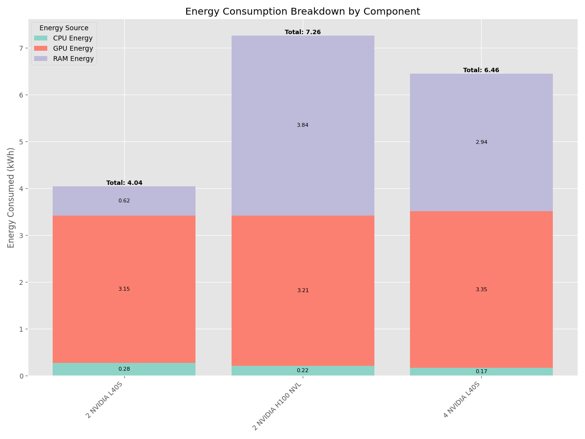
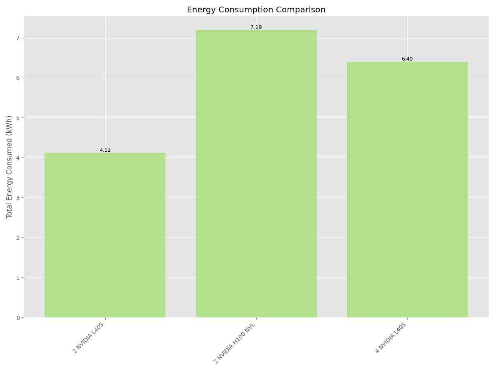
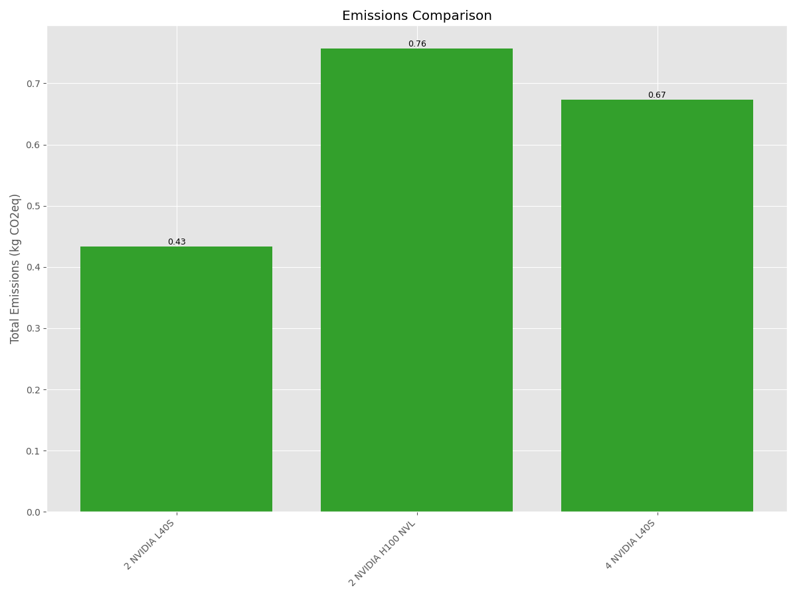
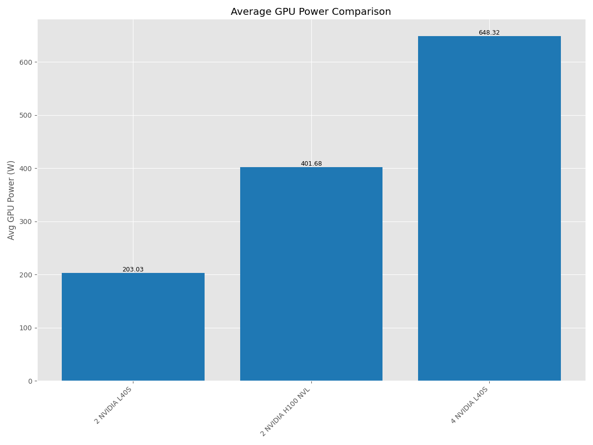
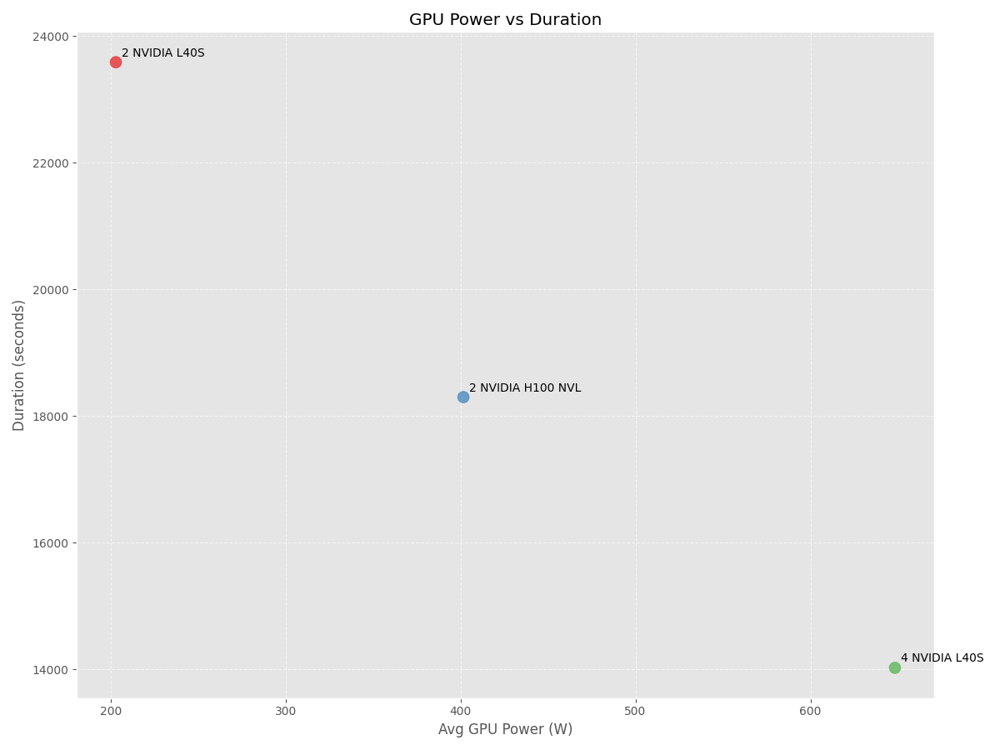
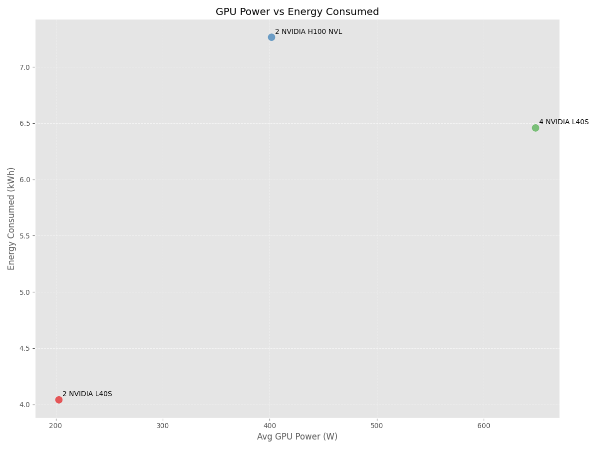

---

# Preface

This document summarizes the benchmarking, training configuration, and performance results obtained while generating the **Vulnerability Severity Classification** model across different GPU architectures.

The  **VLAI Vulnerability Severity Classification** model developed at CIRCL is regularly updated and shared on Hugging Face. It has been presented in:

> Bonhomme, C., & Dulaunoy, A. (2025). *VLAI: A RoBERTa-Based Model for Automated Vulnerability Severity Classification* (Version 1.4.0) [Computer software].  
> https://doi.org/10.48550/arXiv.2507.03607[^1]

[^1]: [https://arxiv.org/abs/2507.03607](https://arxiv.org/abs/2507.03607)

\newpage

# GPU Architectures Used for Benchmarking

The benchmarks in the following sections were performed on the GPU architectures listed below.

| System   | CPU Cores                            | GPU(s)                 | RAM       |
|----------|--------------------------------------|------------------------|-----------|
| A        | 64  (AMD EPYC 9124 16-Core Processor)| 2 × NVIDIA L40S        | 251.5 GB  |
| B        | 224 (Intel Xeon Platinum 8480+)      | 2 × NVIDIA H100 NVL    | 2,014 GB  |
| C        | 224 (Intel Xeon Platinum 8480+)      | 4 × NVIDIA L40S        | 2,014 GB  |

Before presenting the benchmark results, we first describe the dataset and the training parameters used.

# Dataset

The dataset used for training and evaluation is available on Hugging Face:

[https://huggingface.co/datasets/CIRCL/vulnerability-scores](https://huggingface.co/datasets/CIRCL/vulnerability-scores)

at the commit ``cbb05f48e20e2186a80284de138cafee56b6544c``[^2].

This is the updated version of the dataset referenced in ``arXiv.2507.03607``.

Dataset statistics:

- Number of rows: 657,024
- Downloaded size: 162 MB
- Auto-converted Parquet size: 162 MB

This dataset is periodically updated with data collected with [Vulnerability-Lookup](https://vulnerability.circl.lu).

[^2]: [https://huggingface.co/datasets/CIRCL/vulnerability-scores/tree/cbb05f48e20e2186a80284de138cafee56b6544c](https://huggingface.co/datasets/CIRCL/vulnerability-scores/tree/cbb05f48e20e2186a80284de138cafee56b6544c)

# Model

The resulting model is available at on Hugging Face[^3].
This model is a fine-tuned version of [roberta-base](https://huggingface.co/roberta-base) on the dataset [CIRCL/vulnerability-scores](https://huggingface.co/datasets/CIRCL/vulnerability-scores).

[^3]: [https://huggingface.co/CIRCL/vulnerability-severity-classification-roberta-base](https://huggingface.co/CIRCL/vulnerability-severity-classification-roberta-base)

## Training Hyperparameters

The following hyperparameters were used during training:

- **Learning rate:** `3e-05`
- **Train batch size:** `16`
- **Eval batch size:** `16`
- **Seed:** `42`
- **Optimizer:** `ADAMW_TORCH_FUSED`
  - betas: `(0.9, 0.999)`
  - epsilon: `1e-08`
  - optimizer_args: *none*
- **Scheduler:** `linear`
- **Epochs:** `5`

## Framework Versions

The environment used for training:

- **Python:** 3.12.3
- **Transformers:** 4.57.1
- **PyTorch:** 2.9.1+cu128
- **Datasets:** 4.4.1
- **Tokenizers:** 0.22.1

# Benchmark Comparisons

## Duration

## Energy

## Emissions

## GPU Power

## Energy vs. Duration

## GPU Power vs. Duration

## GPU Power vs. Energy

# Resources

## Related to CodeCarbon's RAM Energy Calculation

CodeCarbon primarily calculates the energy used by **RAM** through a **power consumption model** based on estimations, rather than direct hardware measurement, unless specific system features are available.

The power istemation for a "large server" is approximately 40W (using 8x128GB DIMMs with high efficiency scaling).

Reference: [https://mlco2.github.io/codecarbon/methodology.html#ram](https://mlco2.github.io/codecarbon/methodology.html#ram)

### Estimation Methodology

The default method relies on a fixed power consumption value per installed RAM module (DIMM):

1.  **Fixed Power per DIMM:** A standardized, average power consumption value is assigned to each RAM module.
    * For **x86 Systems** (most standard laptops/desktops), this is typically set at **5 Watts** per DIMM.
    * For **ARM Systems** (e.g., Raspberry Pi), a lower base power, like **1.5W** per DIMM, or a constant of **3W**, is used.
2.  **Counting RAM Modules:** CodeCarbon attempts to determine the **number of installed RAM modules (DIMMs)** on the system by querying the operating system.
3.  **Total Power Calculation:** The estimated total RAM power is calculated by multiplying these two values:
    $$\text{RAM Power (Watts)} = \text{Fixed Power per DIMM} \times \text{Number of RAM Slots Used}$$
4.  **Scaling (for Servers):** For systems with many DIMMs (e.g., servers with 8+ slots), a scaling factor is applied to reduce the power assigned to each additional DIMM, acknowledging that power consumption doesn't increase strictly linearly in large configurations.

### Energy Calculation

Once the estimated **RAM Power** (in Watts) is determined, the **Energy Consumed** (in kilowatt-hours, or kWh) is calculated based on the duration of the code execution:

$$\text{Energy (kWh)} = \frac{\text{Power (Watts)} \times \text{Time (hours)}}{1000}$$

### Direct Measurement Alternativev

On Linux systems, CodeCarbon offers a more accurate method with the **Intel Running Average Power Limit (RAPL)** interface.

* If the `rapl_include_dram` parameter is set to `True`, CodeCarbon will attempt to use the **direct power measurement** for the DRAM (memory subsystem) provided by RAPL, overriding the fixed power estimation model. This method offers the most precise consumption data when available.

## Related to CodeCarbon's GPU Energy Calculation

The energy consumptyion is tracked using ``nvidia-ml-py``library.

Reference: [https://mlco2.github.io/codecarbon/methodology.html#gpu](https://mlco2.github.io/codecarbon/methodology.html#gpu)

# Feedback

Feel free to share your feedback at [info@circl.lu](mailto:info@circl.lu).

# Funding

The project aims to create advanced artificial intelligence-based tools that will improve the operations of cybersecurity teams (e.g., sector-level or national-level CSIRT teams, or SOC teams in companies and institutions). These tools will enable faster detection, analysis, and neutralization of threats. We plan to develop intelligent early warning systems, an AI chatbot for analyzing incident reports, and datasets representing current cyberattacks. Work on these solutions has just begun, involving teams from Poland, Luxembourg, the Netherlands, and Italy.

AIPITCH aims to create a comprehensive set of tools supporting key operational services in cyber defense. These include technologies for early threat detection, automatic malware classification, and improvement of analytical processes through the integration of Large Language Models (LLM). The project has the potential to set new standards in the cybersecurity industry.

The project leader is NASK National Research Institute. The international consortium includes:
- CIRCL (Computer Incident Response Center Luxembourg), Luxembourg
- The Shadowserver Foundation, Netherlands
- NCBJ (National Centre for Nuclear Research), Poland
- ABI LAB (Centre of Research and Innovation for Banks), Italy

Funded by the European Union. Views and opinions expressed are however those of the author(s) only and do not necessarily reflect those of the European Union or the European Cybersecurity Competence Centre. Neither the European Union nor the European Cybersecurity Competence Centre can be held responsible for them.

